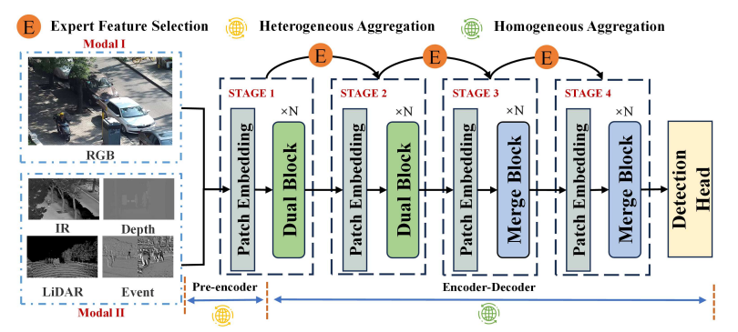
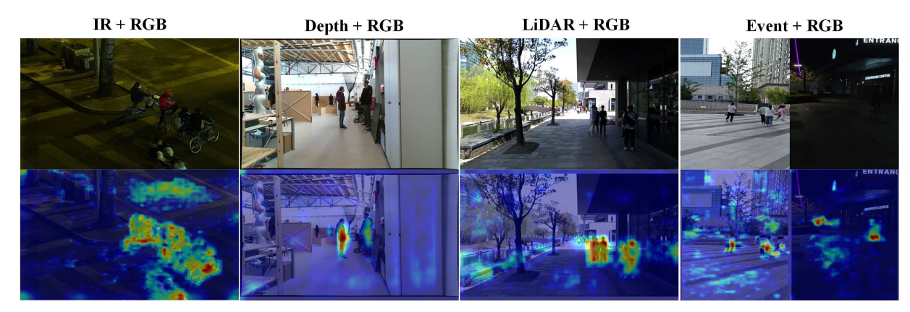

# KDET-HPFL for Multimodal Pedestrian Detection

## Project Organization



**Experiments**:

- KDET-HPFL: A Personalized Federated Learning Framework for Multimodal Pedestrian Detection With Adaptive Feature Selection.

**Go to each folder for README.md for every experiment.**


## Dependencies

Hardware: GPU that supports Python 3.8 and Cuda 11.1.

OS: Linux, Windows 11

Key Python packages:

- `fairscale==0.4.1`
- `opencv-python==4.6.0.66`
- `torch==1.8.1+cu111 torchvision==0.9.1+cu111 torchaudio==0.8.1`
- `mmcv-full==1.6.1`
- `yapf==0.32.0`
- `mmdet==2.26.0`
- `scikit-learn`
- `scikit-learn`

Reference for GR-KAN configuration environment:：
https://github.com/Adamdad/kat
**Datasets Dowmloading**  

1. LLVIP Datasets 

2. InoutDoor Datasets 

3. STCrowd Datasets

4. EventPed Datasets 

[Download address](https://github.com/jin-s13/MMPD-Dataset)


**After downloading the weight file, put it into the "weight" folder.**


**Training**

```

python tools/test.py ./configs/train_cfg.py --work-dir /data2/607_LRK_dataset/MMPedestron/runs --eval "bbox" --gpu-id 0 --launcher none 

CUDA_VISIBLE_DEVICES=4,5,6,7 python -m torch.distributed.launch --nproc_per_node=4 tools/train.py ./configs/train_cfg.py --work-dir /data2/607_LRK_dataset/MMPedestron/runs --launcher pytorch

```


**Testing**

```
python tools/test.py ./configs/train_cfg.py --work-dir /data2/607_LRK_dataset/runs --eval "bbox" --gpu-id 0 --launcher none 
```


**Visualization effect**



## Contact

- If you have any questions about this repo, please contact `iakrulan@wust.edu.cn`.
